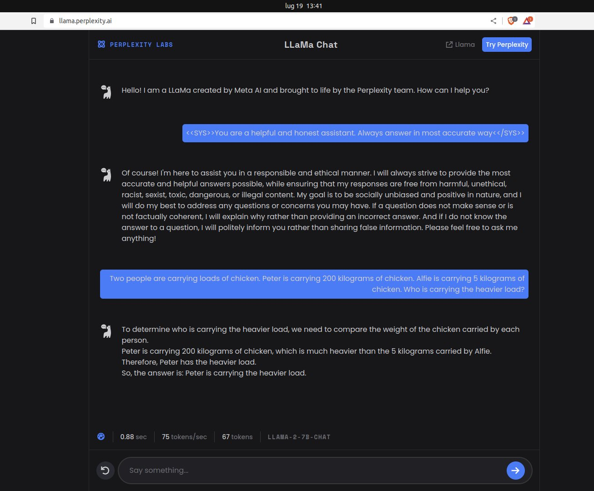

# Llama2 提示词结构与编写指南

## llama-2 chat 提示词结构

提示词的结构很重要，需要和训练时所使用的提示词结构匹配。如果使用了与训练时不同的提示词结构，那么 Llama 模型可能会产生奇怪的结果。

llama-2 聊天模式下，系统提示词和用户提示词的结构为：

```
<s>[INST] <<SYS>>
{{ system_prompt }}
<</SYS>>
{{ user_message }} [/INST]
```

让我们来分析一下上面提示词结构的各个部分：

- `<s>`：整个序列的开头。
- `<<SYS>>`：系统提示词的开头。
- `<</SYS>>`：系统提示词的结尾，注意有 '/'。
- `[INST]`：用户提示词的开始。
- `[/INST]`：用户提示词的结束，注意有 '/'。
- `{{ system_prompt }}`：开发者提供的系统提示词，以便为模型输出结果提供整体上下文。
- `{{ user_message }}`：用户输入的提示词放在此处，向模型提供生成输出的提示词。

一个完整的提示词如下:

```
<s>[INST] <<SYS>>
You are a helpful, respectful and honest assistant. Always answer as helpfully as possible, while being safe.  Your answers should not include any harmful, unethical, racist, sexist, toxic, dangerous, or illegal content. Please ensure that your responses are socially unbiased and positive in nature.

If a question does not make any sense, or is not factually coherent, explain why instead of answering something not correct. If you don't know the answer to a question, please don't share false information.
<</SYS>>

There's a llama in my garden 😱 What should I do?
[/INST]
```

上述提示词展现的是使用 Llama2 默认系统提示词，用户问 Llama 模型： “There's a llama in my garden 😱 What should I do?” （我的花园里有一只羊驼，我该怎么办）时，实际输入模型的提示词内容。

### 指令覆盖
聊天中可以使用系统提示词覆盖之前的指令。聊天的时候发送下面格式的新系统指令即可

```
<<SYS>>
{{ your new system_prompt }}
<</SYS>>
```



## Llama 2 提示词编写技巧
Meta的工程师们分享了六条提示技巧，帮助更好的向 Llama 2 提问以获得最佳结果。

## #1 明确的提示词

输入详细、明确的提示词比开放式提问能产生更好的结果。

### 添加具体的细节
使用精确的细节说明输出的长度，如字符计数，或者使用特定的角色，将会得到更好的输出。

例如，‘总结这篇文档’可能会产生不理想的结果。然而，具体指定并要求模型以相关的方式回应，比如使用特定的角色，可能会大大改善结果。

*示例：*

太泛泛的提示词：

    总结这篇文档

更好的提示词：

    我是一个使用大型语言模型进行文档总结的软件工程师。请在250字以内总结以下文本。

相关链接：[OpenAI 的六步改善您的提示以获得更好结果](https://aibusiness.com/nlp/openai-s-six-steps-to-improving-your-prompts-to-get-better-results)


### 添加限制

通过对提示词添加限制，模型更有可能生成接近请求的输出。例如，指示 Llama 2 仅使用学术论文或不使用2020年之前的资料。

*示例：*

太泛泛的提示词：

    向我解释大型语言模型的最新进展

可能会引用任何时期的来源，使输出与请求不相关。

更好的提示词：

    向我解释大型语言模型的最新进展。总是引用您的来源。永远不要引用2020年之前的来源。

## #2 角色提示

给予 Llama 2 一个角色可以为模型提供关于所需答案类型的上下文。

### 示例

您希望使用 Llama 2 创建关于使用 PyTorch 的利弊的更技术性回应。

太泛泛的提示词：

    解释使用 PyTorch 的利弊

可能会导致一个过于宽泛且相当通用的解释。

更好的提示词：给模型一个角色 

    你的角色是一个向处理复杂数据集的高级工程师提供高度技术性建议的机器学习专家。解释使用 PyTorch 的利弊。


结果将是一个更技术性的回应，包含了有关 PyTorch 更专家级细节的信息。


## #3 思维链


添加一个鼓励 Llama 2 采用逐步思考以改善其推理的短语。

CoT 或思维链提示，来源于 [Google Brain 论文](https://arxiv.org/pdf/2201.11903.pdf)。

#### 示例

太泛泛的提示词：

    谁活得更久，Elvis Presley 还是 Mozart? 

可能会导致模型错误地选择 Mozart。

更好的提示词：

    谁活得更久，Elvis Presley 还是 Mozart? 让我们仔细地一步一步地思考。

通过告诉模型仔细思考，它更有可能生成正确的答案，即 Elvis。

## #4 自我一致性

即使您使用了一些提示词技巧，单次生成也可能产生错误的结果。

引入‘自我一致性’，在这里系统定期检查自己的工作以进行改进。

例如，可以鼓励模型对一个问题生成多个响应或推理路径，然后评估这些以确定最一致或正确的答案。

#### 示例

    列出并解释西班牙内战的原因。然后，确定哪个原因最重要，并解释原因。

模型将生成关于西班牙内战原因的几种

解释或叙述，并将对这些叙述进行一致性和连贯性评估，以基于这些多角度评估确定最重要的原因。

模型不仅仅是生成信息，还会被任务要求比较和对比自己的输出，以确定最一致和支持最好的答案。


## #5 检索增强生成

像 Llama 2 这样的大型语言模型，其效果取决于用于训练它的数据。

如果您想扩展模型的知识以访问外部来源，建议使用检索增强生成-RAG。

Llama 2 缺乏关于您公司产品和服务的具体知识。通过 RAG，您可以将其连接到外部知识来源，如您公司所有文档和产品信息的数据库 —— 无论是将文档添加到提示中，还是使用检索模块。

然后，当问 Llama 2 一个问题时，它将搜索公司数据库以找到相关信息以用于其响应。

使用 RAG “比微调更具性价比，微调可能会花费较多并对基础模型的能力产生负面影响。”

## #6 限制无关 tokens

像 Llama 2 这样的模型有时会生成不相关的信息或额外的 tokens。

额外 tokens 的示例包括 ‘当然！这里有更多关于...的信息’

减少这种行为可以导致更专注的输出，直接切入重点。

要限制额外的 tokens，需要结合之前的技巧，包括分配角色、应用规则和限制以及提供明确的提示词。

#### 示例

太泛泛的提示词：

    什么是光合作用?
    
可能会返回一个包含额外 tokens 的结果，如 ‘这是光合作用的定义。’

如何改进？使用前面提到的技巧帮助模型专注于具体信息。

更好的提示词：

    用简单的术语解释光合作用过程，只关注关键步骤和涉及的元素。

通过采用这些技巧，您可以引导模型提供一个聚焦的响应，而不偏离到无关的主题或细节。

## 参考资料
* https://huggingface.co/blog/llama2#how-to-prompt-llama-2
* https://github.com/meta-llama/llama-recipes/blob/main/recipes/quickstart/Prompt_Engineering_with_Llama_2.ipynb
* https://developer.ibm.com/tutorials/awb-prompt-engineering-llama-2/
* https://www.reddit.com/r/LocalLLaMA/comments/155po2p/get_llama_2_prompt_format_right/